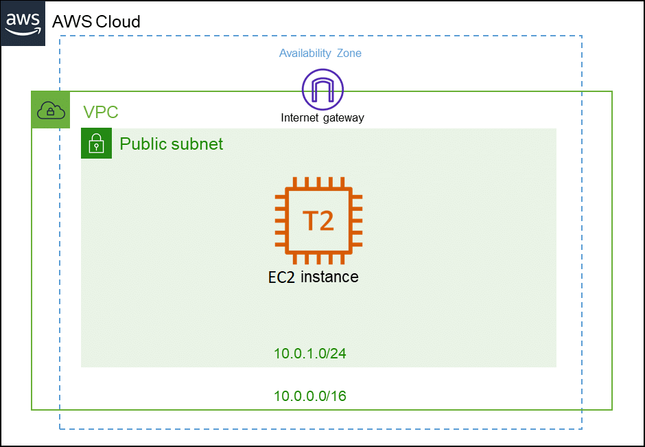

<h1>Projeto SiteControlCash</h1>

<h2>Resumo Designer Patterns JS:</h2>

Este documento apresenta os padrões de design mais básicos implementados em JavaScript, separados em três categorias: padrões criacionais, padrões estruturais e padrões comportamentais. Cada padrão é brevemente explicado com exemplos e uma visão geral rápida dos exemplos pode ser encontrada no arquivo docs.md. Os padrões são úteis para criar programas mais flexíveis, com facilidade de inclusão ou exclusão de valores, novas funcionalidades e comunicação entre objetos.

## O aplicativo de controle financeiro possui as seguintes funcionalidades:

Modal com formulário para adição de transação
Remoção de transação ao clique
Validação client-side dos dados
Armazenamento e persistência de dados com Local Storage
Visualização do saldo de entrada e saída.
Cadastro e exclusão de transações
Alteração de tema com JavaScript e variáveis CSS.


<h2>Tecnologias Utilizadas</h2>

As seguintes tecnologias foram utilizadas para o desenvolvimento deste projeto:

-  HTML
-  CSS
-  JavaScript


## Padrão de Projeto: "Observer with Theme Strategy"

Descrição: Este padrão utiliza o padrão Observer para notificar a mudança de tema para todos os elementos que dependem do tema. Além disso, utiliza o padrão Strategy para gerenciar os diferentes temas disponíveis.

Componentes:

Subject: Modal interativo para inserção de transação.
Observer: Elementos que dependem do tema, como a cor de fundo da página e o estilo dos botões.
Concrete Observer: Componentes específicos que observam a mudança de tema, como o botão de alternância de tema.
Strategy: Gerenciador de temas, que define as variáveis CSS apropriadas para cada tema.
Concrete Strategies: Estratégias específicas para cada tema, como tema claro e tema escuro.
Funcionamento:

Quando o usuário seleciona um novo tema, o Concrete Observer notifica o Subject, que por sua vez notifica todos os Observers registrados.
Cada Observer utiliza o Strategy correspondente para atualizar suas variáveis CSS e alterar seu estilo de acordo com o novo tema.
Benefícios:

Separação clara de responsabilidades entre a mudança de tema e a atualização de estilo dos elementos dependentes.
Flexibilidade para adicionar novos temas sem afetar a lógica do Observer.
Facilidade de manutenção e modificação dos temas, já que cada estratégia é independente e pode ser facilmente modificada ou estendida.


## LAYOUT
Abaixo estão as imagens de ilustração do projeto:


## EXECUTAR PROJETO LOCAL

```bash
- Clone o projeto no HTTP do github

- Depois de clonado, acesse a pasta feito o download

- Abra o projeto clicando no arquivo index.html
```


## EXECUTAR PROJETO DOCKERFILE

```bash
- Clone o projeto no HTTP do github

- Depois de clonado, instalar o Docker no seu computador

- vá até a pasta onde está o arquivo Dockerfile

- rodar os dois comandos abaixo:

- docker build -t nityo-controle-fluxo/davi-versao:1.0 .

- docker run -d --name nityo-controle-fluxo -p 8080:80 nityo-controle-fluxo/davi-versao:1.0

- abrir projeto na porta localhost:8080
```

## MODELO DE SUPOSTA SOLUÇÃO

Nossa solução utiliza a tecnologia de nuvem da AWS para garantir total confiança e segurança na disponibilidade da aplicação. Começaremos pela base do repositório da aplicação e, se necessário, criaremos uma pipeline utilizando o poderoso CI do Jenkins.

Para garantir a economia de recursos, utilizaremos instâncias sob-demanda que serão ligadas somente quando necessário e desligadas quando não estiverem em uso.

Para facilitar a implantação, oferecemos duas opções: a primeira é utilizar o Docker dentro do EC2 com uma arquitetura de imagem segura, pronta para a disponibilização da aplicação. A segunda opção é executar a aplicação localmente dentro da instância EC2, sem a necessidade de processos complexos, e com toda a segurança garantida pela arquitetura da imagem VPC, NAT GATEWAY, entre outras.



<h2>Contribuindo</h2>
Este projeto está aberto a contribuições da comunidade. Caso queira contribuir, basta fazer um fork do repositório, fazer as suas alterações e enviar um pull request. Faremos a revisão das suas alterações e, se estiverem de acordo com as diretrizes do projeto, elas serão incorporadas ao código principal.
Também agradecemos a contribuição de patrocinadores, que podem entrar em contato via email devops.davi@gmail.com para colaborar com o projeto, seja com pequenas doações para obter o projeto com mais recursos e funcionalidades ou para desenvolvimento personalizado para empresas e clientes. Agradecemos antecipadamente a todos que se interessam em ajudar a melhorar este projeto.

<h2>Licença</h2>
Este projeto está licenciado sob a licença MIT. Veja o arquivo LICENSE para mais detalhes.
<h2>Autor</h2>
Desenvolvido por Davi, 2023.

<h2>Ícones das tecnologias utilizadas</h2>
Abaixo estão os ícones das tecnologias utilizadas neste projeto:
HTML 
CSS 
JavaScript 
<h2>Foto do autor</h2>
<p>Davi DevOps:</p>
